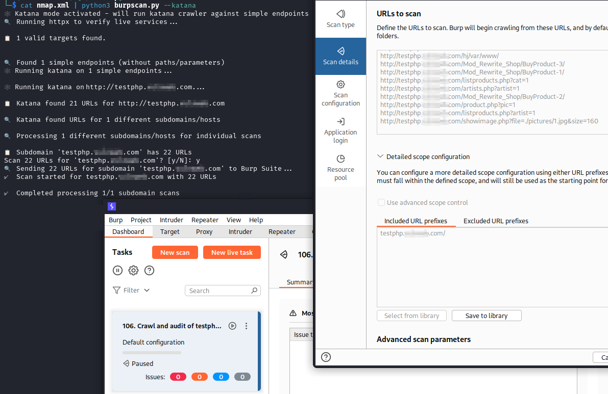

# BurpScan
A powerful utility to automate unauthenticated web application security testing with Burp Suite by handling various input formats, intelligently discovering endpoints, and creating properly scoped scans.




# Overview
BurpScan bridges the gap between reconnaissance tools and Burp Suite Professional, making unauthenticated web application security testing more efficient. It intelligently processes various input formats, verifies live services, optionally discovers endpoints with katana, and creates properly scoped Burp Suite active scans.

# Features
- Multiple Input Formats: Process Nessus reports, Nmap XMLs, plain text lists, URLs, IPs, or CIDR ranges
- Subdomain Isolation: Creates separate, properly scoped scans for each subdomain
- Intelligent Crawling: Optional katana integration to discover endpoints before scanning
- Input Validation: Detects complex URLs and warns about incompatibility with katana mode
- Security-Focused: Maintains tight scope control to prevent scanner sprawl
- Error Handling: Saves discovered URLs to files if API calls fail, allowing later retry
- Interactive Mode: Allows selective scanning of discovered targets

# Prerequisites
- Python 3.6+
- Burp Suite Professional
- ProjectDiscovery's [httpx](https://github.com/projectdiscovery/httpx) and [katana](https://github.com/projectdiscovery/katana)
- Golang

# Configure Burp Suite Professional:
- Go to Settings → Suite → REST API
- Enable "Service running"
- Optionally set up an API key for added security
- Optionally install and enable any bchecks that you want to run with your scans

# Usage
```
python3 burpscan.py <input>
```
Where <input> can be:
- A .nessus file
- An Nmap XML file
- A text file with URLs/domains/IPs
- A single URL, IP, or CIDR range

Command-Line Options
```
python3 burpscan.py --help
usage: burpscan.py [-h] [--debug] [--api-key API_KEY] [--hailmary] [--katana] [input]

       python3 burpscan.py <file.nessus>
       python3 burpscan.py <file.xml>
       python3 burpscan.py <file.txt>
       python3 burpscan.py '<IP>'
       python3 burpscan.py '<CIDR>'
       python3 burpscan.py '<URL>'
       OR
       cat <file> | python3 burpscan.py
       echo '<file>' | python3 burpscan.py

optional arguments:
  -h, --help           show this help message and exit
  --debug              Enable verbose debug output
  --api-key API_KEY    API key (You can add one in Burp Suite settings)
  --hailmary           Automatically answer 'yes' to all prompts (except Burp API errors)
  --katana             Run katana crawler against simple endpoints before sending to Burp Suite
```
  
# Examples
Scan a single domain:
```
python3 burpscan.py example.com
```
Scan with Katana crawler:
```
python3 burpscan.py example.com --katana
```
Process Nessus scan:
```
python3 burpscan.py scan-results.nessus
```
Process Nmap XML with API key:
```
python3 burpscan.py nmap-output.xml --api-key YOUR_API_KEY
```
Auto-accept all prompts: (Use with caution!)
```
python3 burpscan.py targets.txt --hailmary
```
Process stdin input:
```
cat targets.txt | python3 burpscan.py
```

# How It Works
- Input Processing: Parses and normalizes input from various formats
- Service Verification: Uses httpx to verify live HTTP/HTTPS services
- URL Classification: Separates simple endpoints from complex URLs
- Optional Crawling: If --katana is enabled, runs katana crawler on simple endpoints
- Subdomain Grouping: Groups URLs by subdomain for separate scans
- Scope Configuration: Creates proper scope for each subdomain to prevent scanner sprawl
- Active Scanning: Sends requests to Burp Suite API to initiate properly scoped active scans

# Common Workflows
Basic Reconnaissance to Scan
1. Run Nmap scan
```
nmap -p 0-65535 -oX results.xml <target>
```
2. Feed results to BurpScan
```
python3 burpscan.py results.xml
```

Vulnerability Assessment Follow-up
1. After running a Nessus scan, export the .nessus file
2. Feed it to BurpScan for deeper web application testing
```
python3 burpscan.py nessus-results.nessus --katana
```
Bug Bounty Hunting
1. Get subdomains from subfinder
2. subfinder -d target.com -o subdomains.txt
3. Feed to BurpScan with katana for deeper reconnaissance
```
python3 burpscan.py subdomains.txt --katana
```

# Troubleshooting

1. httpx not found: Ensure you've installed ProjectDiscovery's httpx, not the Python package:
```
sudo apt purge python3-httpx -y # Remove the kali pre-installed httpx
```
2. API connection errors: Verify Burp Suite is running and the REST API is enabled
3. katana errors: Verify katana is installed and in your PATH

# Credits
[ProjectDiscovery](https://projectdiscovery.io/) for their excellent httpx and katana tools

[PortSwigger](https://portswigger.net/) for Burp Suite and their REST API


Note: This tool is intended for legal security testing with proper authorization. Always ensure you have permission to scan the targeted systems.
