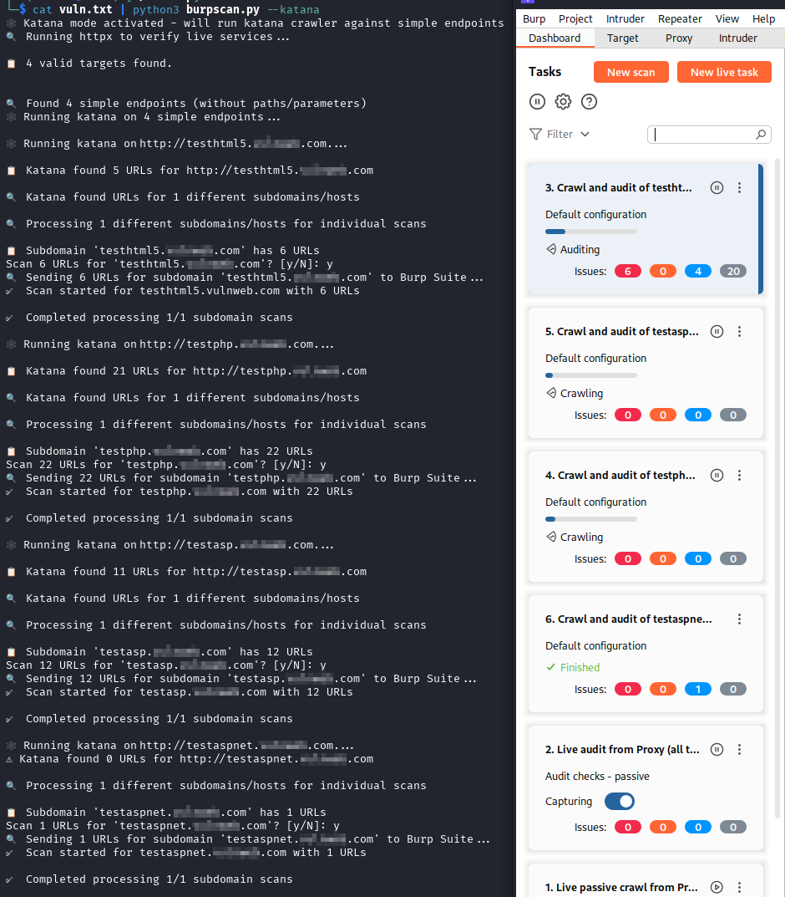

# BurpScan

BurpScan is a Python script designed to perform unauthenticated active scans using Burp Suite. It allows users to input various types of files or network addresses and processes them to facilitate scanning.



## Features

- Supports multiple input formats:
  - `.nessus`, `.xml`, `.txt` files
  - IP addresses, CIDR notations, and URLs
- Can read input from standard input (stdin)
- Integrates with `httpx` for silent processing of URLs before scanning
- Debug mode for verbose output

## Prerequisites

Before running the script, ensure you have the following:

- **Burp Suite**: Make sure you have Burp Suite installed and configured.
- **Golang**: If you haven't figured out how to install `go` yet, you shouldn't be here.
- **httpx**: Purge any existing version of `httpx` from Kali and install ProjectDiscovery's version.
- **bchecks**: Install and set up `bchecks` and any other extensions you prefer.

## Usage

You can run the script in several ways:

```bash
python3 burpscan.py <file.nessus>
python3 burpscan.py <file.xml>
python3 burpscan.py <file.txt>
python3 burpscan.py '<IP>'
python3 burpscan.py '<CIDR>'
python3 burpscan.py '<URL>'
# OR
cat <file> | python3 burpscan.py
Command-Line Arguments
input: Path to a .nessus, .xml, or .txt file, or an IP/domain/CIDR/URL. You can also use stdin.
--debug: Enable verbose debug output.
--api-key: Provide an API key (you can add one in Burp Suite settings).
```
Installation
Clone the repository:
```bash
git clone https://github.com/yourusername/burpscan.git
cd burpscan
```
Install the required dependencies (if any):
```bash
sudo apt purge python3-httpx -y
go install -v github.com/projectdiscovery/httpx/cmd/httpx@latest
```
Ensure you have Burp Suite and the necessary tools set up as mentioned in the prerequisites.

Disclaimer
This script is intended for educational purposes only. Use it responsibly and ensure you have permission to scan any network or application.
